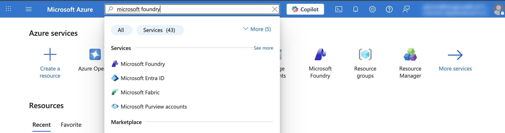
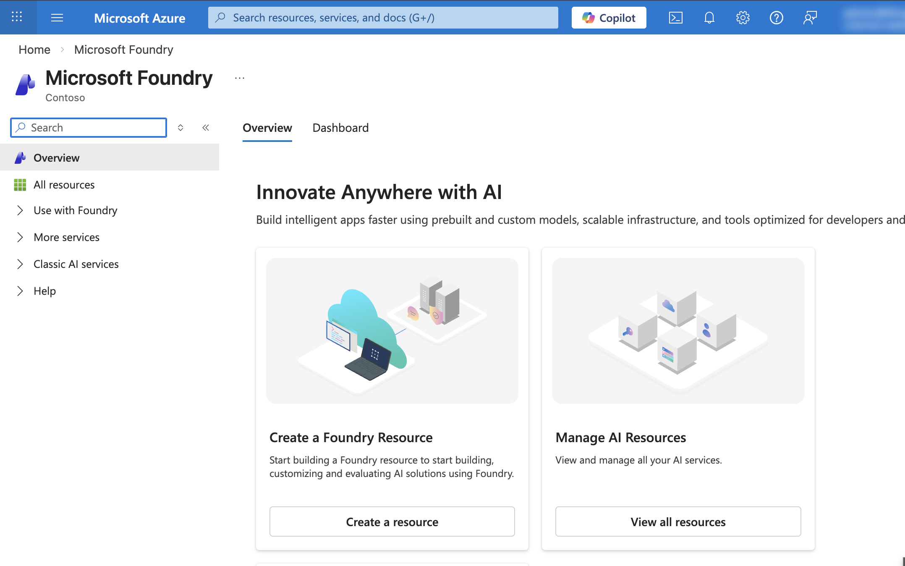
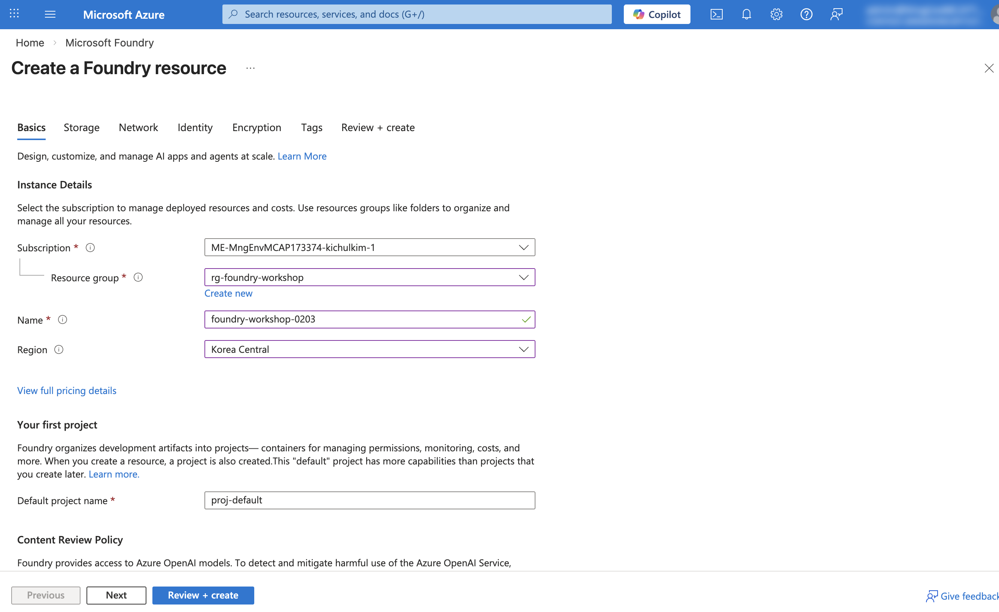
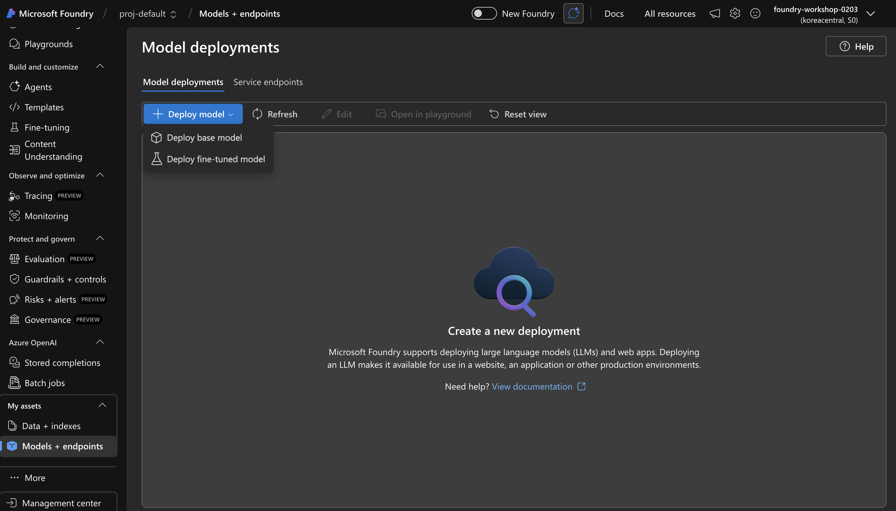
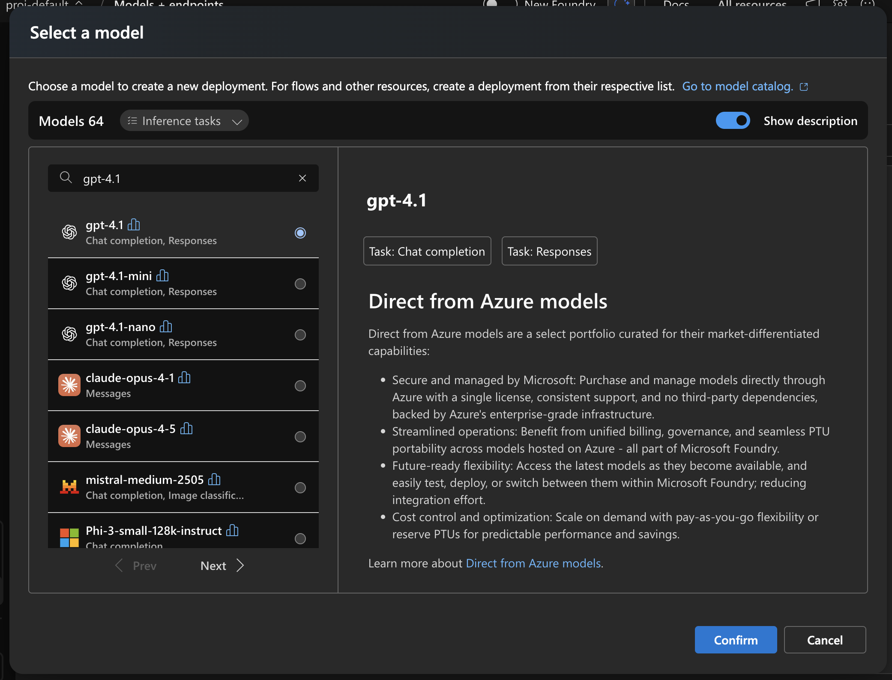
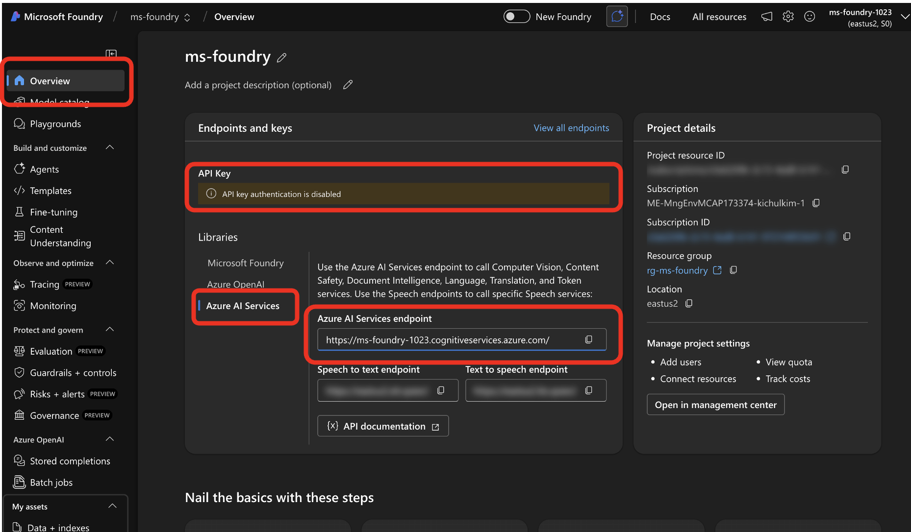
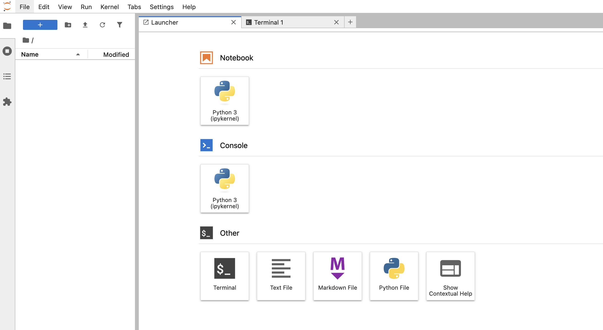
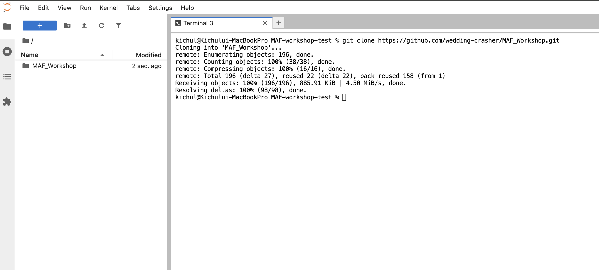
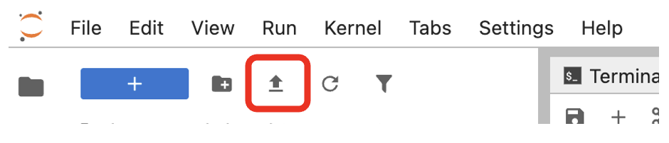
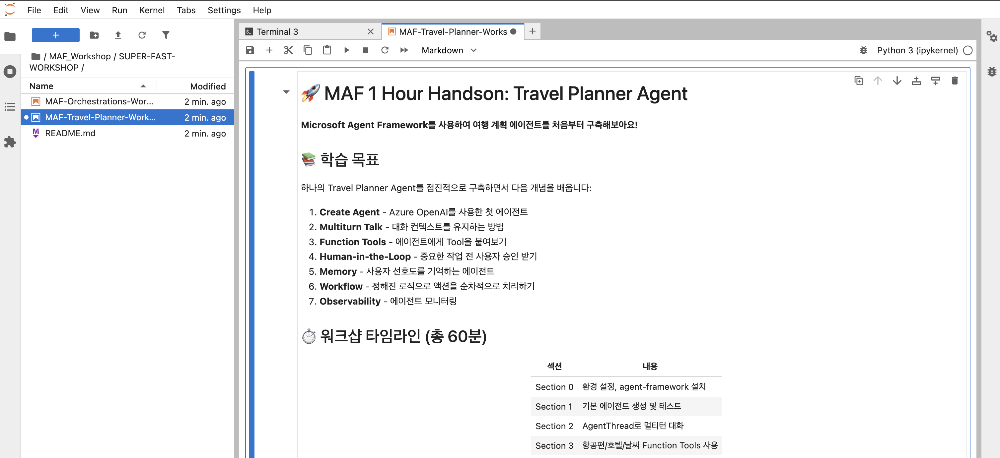

# 🚀 MAF Super Fast Workshop

Microsoft Agent Framework 핸즈온 워크샵 노트북입니다.

## 📚 워크샵 노트북

| 노트북 | 내용 |
|--------|------|
| `MAF-Travel-Planner-Workshop.ipynb` | Travel Planner Agent 구축 (Agent, Tools, Memory, Workflow) |
| `MAF-Orchestrations-Workshop.ipynb` | 멀티 에이전트 오케스트레이션 (Concurrent, Group Chat) |

---

## ⚡ 환경 설정 (10분)

### Step 0. 사전 준비: Microsoft Foundry 설정

#### Step 1. Microsoft Foundry 프로젝트 생성

[Microsoft Foundry Portal](https://ai.azure.com/)에서 새 프로젝트를 생성합니다.

Microsoft Foundry 검색


Create a Foundry Resource 클릭


이름(고유값) 과 Region(Korea Central) 선택 후 `리뷰 + 생성` 후 다시 `생성` 클릭



#### Step 2. GPT-4.1 모델 배포

프로젝트 내에서 GPT-4.1 (또는 GPT-4o) 모델을 배포합니다.

왼쪽 메뉴에서 `Models + endpoints` 클릭


`gpt-4.1` 모델 선택 후 기본 값으로 배포



#### Step 3. Endpoint 확인

배포된 모델의 **Endpoint URL** 과 **(옵션) API Key**를 복사해 둡니다.

`az login` 대신 API Key를 사용할 경우, Key도 복사해 둡니다.




---


### Step 1. Python 설치 & 가상환경 생성

- ✅ [Python 3.12 설치](https://www.python.org/downloads/)
- ✅ 인증 방법 택1:
  - **(권장)** [Azure CLI 설치](https://learn.microsoft.com/en-us/cli/azure/install-azure-cli) 후 `az login` 실행
  - 또는 Azure OpenAI API Key 준비

먼저 Python 3.12가 설치되어 있는지 확인합니다:
```bash
python --version      # 또는
python3 --version     # 또는  
python3.12 --version
```
> 💡 환경에 따라 `python`, `python3`, `python3.12` 중 하나가 동작합니다. 동작하는 명령어를 사용하세요.

**Windows (PowerShell)**
```powershell
python -m venv .venv
.venv\Scripts\Activate
```

**Mac / Linux**
```bash
python3.12 -m venv .venv
source .venv/bin/activate
```

> 💡 **(옵션) 가상환경 비활성화**: `deactivate` 입력 (Windows/Mac/Linux 동일) - 지금은 실행하지 마세요!

### Step 2. JupyterLab 설치 & 실행

```bash
pip install jupyterlab
python -m jupyter lab
```

> 💡 토큰을 입력하라고 뜨면 터미널창의 주소에 있는 토큰을 복사해서 붙여넣습니다. 

> 💡 브라우저가 자동으로 열리지 않으면 http://localhost:8888 로 접속하세요.

### Step 3. 워크샵 저장소 클론

JupyterLab에서 **Terminal** 열기 (File → New → Terminal 혹은 메인 화면에서 'Terminal' 클릭):



터미널에서 아래 명령어 실행:
```bash
git clone https://github.com/wedding-crasher/MAF_Workshop.git
```



클론 완료 후 왼쪽 **파일 탐색기**에서 `MAF_Workshop` → `SUPER-FAST-WORKSHOP` 폴더로 이동합니다.

> 💡 `git` 명령어가 동작하지 않으면 MAF-Orchestrations-Workshop.ipynb 파일과 MAF-Travel-Planner-Workshop.ipynb 파일을 다운 받아서 Jupyter Notebook 에 업로드 합니다.

> 파일을 Jupyter Notebook 을 실행한 폴더에 넣어도 되고 아래와 같이 다운로드 한 후 불러와도 됩니다.



### Step 4. 노트북 열고 시작!

`MAF-Travel-Planner-Workshop.ipynb` 파일을 더블클릭하여 열어주세요.



노트북 내 첫 번째 셀에서 `agent-framework` 패키지가 자동 설치됩니다.

---

## 🔗 참고 링크

- [Microsoft Agent Framework 문서](https://learn.microsoft.com/en-us/agent-framework/)
- [Azure OpenAI 설정 가이드](https://learn.microsoft.com/en-us/azure/ai-services/openai/)
